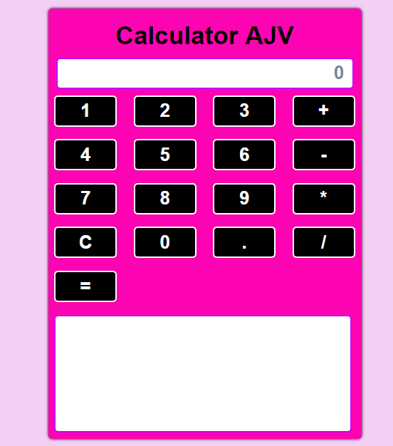

# Proyecto Calculadora

En el presente proyecto se desarrollo una calculadora para poner en practica los conceptos de REACT Y REDUX, haciendo una integración de ambos.
Este proyecto se creó con la aplicación [Create React App](https://github.com/facebookincubator/create-react-app).

## Cómo ejecutar la aplicación localmente

Ingresar a la carpeta e instalar 

```
cd calculadora-react-redux
npm install
```

Ejecuta la aplicación

```
npm start
```

Si quieres salir de la aplicación

```
ctrl + C
```


## Tecnologias  Utilizadas

- React
- Redux
- Html 5 
- Css3
- es6

## Conceptos clave

- Para la realización de este proyecto se tuvo que tener bien definido los siguientes conceptos:

States, Actions y Reducers

- Para relacionar el estado con las actions, escribimos funciones puras que llamaremos reducers. Un reducer es una función que recibe el state y una action como parámetros y retorna el nuevo state de la aplicación. 

## WebSite

Puede ver una versión en vivo de este proyecto aquí: https://Jennifercarmen.github.io/calculadora-react-redux



## Colaboradoras

- Vannesa Mendoza
- Araceli Cueva
- Jennifer Carmen
